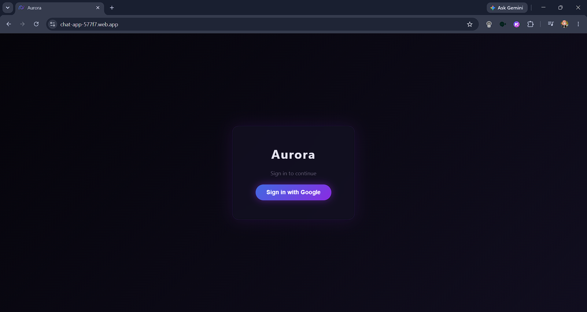
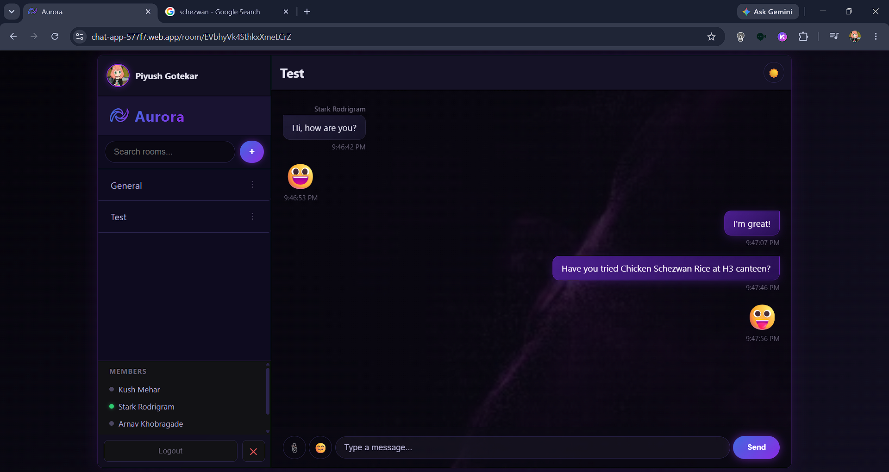
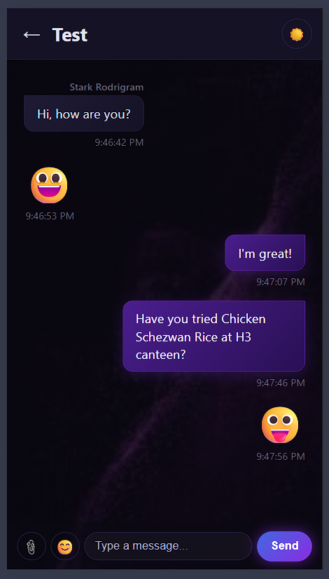
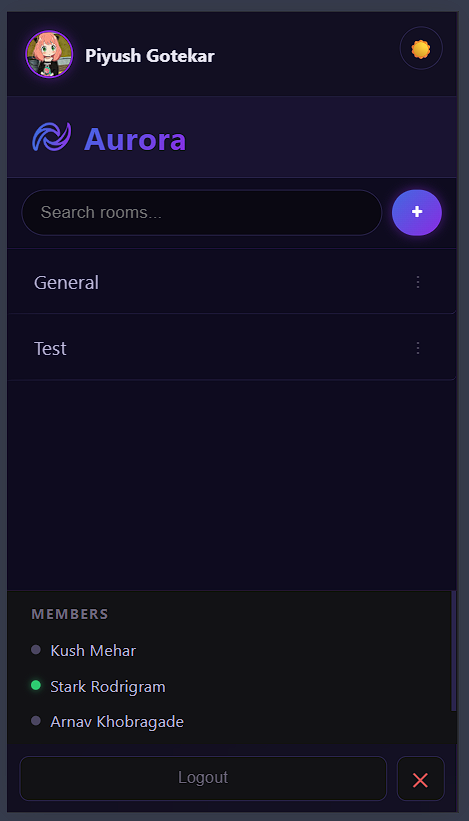
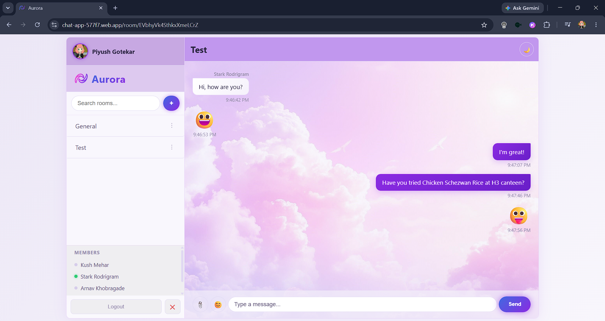

# Aurora — Real-Time Chat App

A real-time messaging web app built from scratch with React and Firebase, supporting chat rooms, presence indicators, typing status, image sharing, and dark mode.

**Live demo:** [chat-app-577f7.web.app](https://chat-app-577f7.web.app)
**Repo:** [github.com/Lyrisink/Real-Time-Chat-App](https://github.com/Lyrisink/Real-Time-Chat-App)

---

## About This Project

Aurora was built as part of a structured 8-week full-stack learning path — starting from raw HTML/CSS/JS fundamentals, through vanilla DOM manipulation, into React, and finally a full Firebase backend with authentication, real-time data, and deployment. The very first version of this chat UI was a static HTML/CSS/JS page with no real backend; it was later rebuilt from scratch in React and progressively layered with real-time messaging, presence, media sharing, and production-grade security rules.

---

## Screenshots

| Login | Chat Room |
|---|---|
|  |  |

| Mobile View (Chat Window) | Mobile View (Chats List) |
|---|---|
|  |  |

| Light Mode |
|---|
|  |

---

## Features

- 🔐 Google authentication via Firebase Auth
- 💬 Real-time messaging with Firestore (`onSnapshot` live listeners)
- 🏠 Multiple chat rooms — create rooms, add/remove members
- 🌍 A public "General" room every user auto-joins on login
- 🏷️ Sender name shown above messages in group rooms, collapsed for consecutive messages from the same person
- 🟢 Online/offline presence indicators via Firebase Realtime Database
- ⌨️ Live typing indicators
- 🖼️ Image sharing (uploaded via Cloudinary)
- 😊 Emoji picker
- 🌗 Dark mode / light mode toggle, persisted via `localStorage`
- 👋 Self-removal from the member list, with a confirmation prompt
- 📱 Responsive layout — mobile view switches between room list and chat with a back button
- 🔒 Firestore security rules enforcing authenticated, member-only access

---

## Tech Stack

- **Frontend:** React (Vite), React Router
- **Auth:** Firebase Authentication (Google Sign-In)
- **Database:** Cloud Firestore (rooms & messages), Firebase Realtime Database (presence & typing status)
- **Image hosting:** Cloudinary (unsigned client-side uploads)
- **Hosting:** Firebase Hosting
- **Other libraries:** `emoji-picker-react`

---

## Architecture Overview

- **Firestore** stores persistent data — `rooms` (with a `members` array per room) and each room's `messages` subcollection. Reads/writes are gated by Firestore Security Rules: a user can only read a room they're a member of (or the public "General" room), and can only send a message as themselves (`senderId` must match their own uid).
- **Realtime Database** handles ephemeral, high-frequency data — online/offline status (`/status/{uid}`) and typing indicators (`/typing/{roomId}/{uid}`) — using `onDisconnect()` so status auto-updates even if a user closes the tab without a clean logout.
- **Cloudinary** handles image uploads directly from the browser via an unsigned upload preset, decoupled from Firebase Storage (which requires a billing plan).
- **Firebase Hosting** serves the built Vite app as a static SPA, with client-side routing handled by React Router.

---

## Running Locally

1. Clone the repo:
   ```bash
   git clone https://github.com/your-username/chat-app.git
   cd chat-app
   ```

2. Install dependencies:
   ```bash
   npm install
   ```

3. Create a `.env` file in the project root with your own Firebase and Cloudinary credentials:
   ```env
   VITE_FIREBASE_API_KEY=
   VITE_FIREBASE_AUTH_DOMAIN=
   VITE_FIREBASE_DATABASE_URL=
   VITE_FIREBASE_PROJECT_ID=
   VITE_FIREBASE_STORAGE_BUCKET=
   VITE_FIREBASE_MESSAGING_SENDER_ID=
   VITE_FIREBASE_APP_ID=
   VITE_CLOUDINARY_CLOUD_NAME=
   VITE_CLOUDINARY_UPLOAD_PRESET=
   ```
   You'll need your own Firebase project (with Authentication, Firestore, and Realtime Database enabled) and a Cloudinary account with an unsigned upload preset.

4. Run the dev server:
   ```bash
   npm run dev
   ```
   Open the printed `localhost` URL in your browser.

---

## Security

Firestore access is restricted via security rules — only authenticated users can read/write data, room access is limited to members (or public rooms), and message writes are verified to come from the actual sender. Firebase config is loaded from environment variables and never committed to the repo.

---

## Future Improvements

- Message editing & deletion
- Read receipts
- Push notifications for new messages when the tab isn't focused
- Reactions/emoji responses to individual messages
- Message search within a room
- Custom domain instead of the default `.web.app` URL
- Signed Cloudinary uploads (moving off the unsigned preset) for tighter upload security
- Pagination/lazy-loading for message history in rooms with long histories (currently loads the full history on room open)

---

## What I Learned

Beyond the React and Firebase specifics, this project taught me how to actually *build* something end-to-end rather than follow a tutorial passively. I learned to reason about async state (`useEffect` cleanup, listener subscriptions, `onSnapshot` vs one-time reads) instead of just copying patterns, and to design a real-time system by choosing the right tool for each job — Firestore for persistent data, Realtime Database for ephemeral presence/typing state.

Just as importantly, I learned how to actually manage a multi-week project: using Git branches for feature work instead of committing straight to `main`, debugging methodically instead of guessing (reading actual error messages, checking the Network tab, isolating variables one at a time), and breaking a big goal into small, testable steps rather than trying to do everything in one pass. I went from writing code I only shallowly understood to being able to explain *why* each piece works the way it does.
